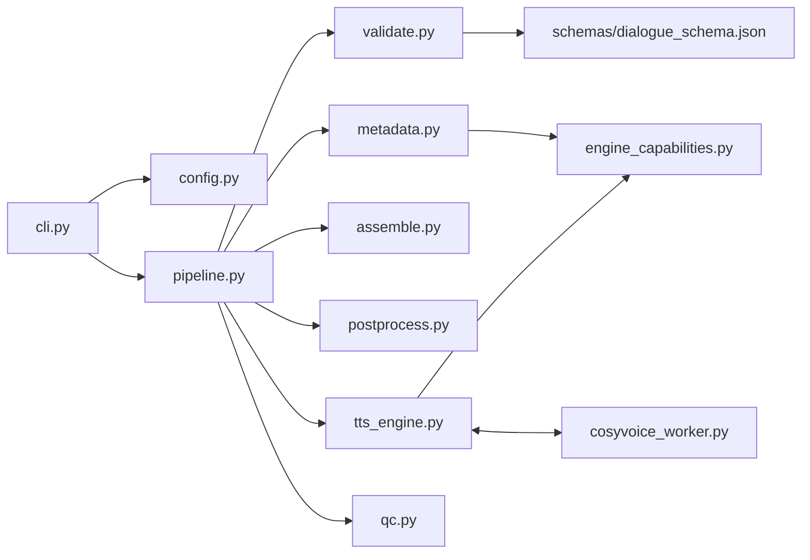
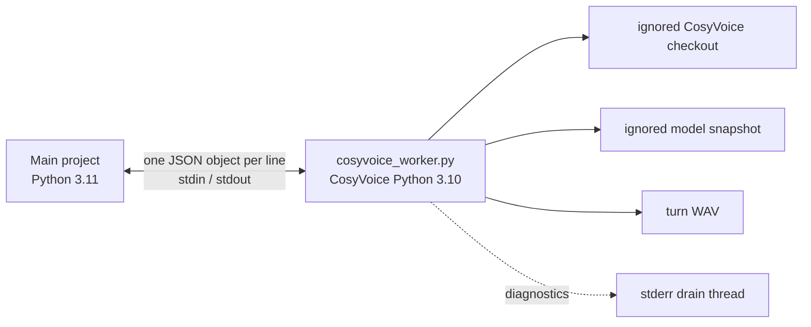

# 5703tts Architecture Reference

## Purpose and current scope

`5703tts` converts structured crisis-dialogue JSON into a turn-aligned audio dataset. For each valid dialogue it renders one audio file per turn, assembles non-overlapping clean dialogue audio, derives a telephone-band version, writes per-turn metadata, and runs basic structural QC.

The repository is a rendering workstream, not a crisis detector. It preserves upstream crisis labels for downstream use but does not predict or validate those labels. The default configuration selects CosyVoice3; Kokoro is the supported local comparison backend, EdgeTTS is an online code path, and Chatterbox Turbo is an uninstalled experimental path.

## Architectural principles

1. **The canonical input stays model-independent.** Schema v0.2 expresses semantic `acoustic_spec` values. Engine adapters translate them only at the synthesis boundary.
2. **Schema support is not backend support.** `engine_capabilities.py` declares whether each backend uses a control as `model_control`, `provisional_model_control`, `pipeline_timing`, or `unsupported`.
3. **Requested intent is not observed acoustics.** Metadata preserves requests and mappings; it does not claim that generated speech perceptually satisfies them.
4. **Speech synthesis and timeline construction are separate.** Engines render speech; `assemble.py` implements pauses and timestamps.
5. **Turns never overlap.** Assembly uses direct concatenation and short edge fades, not crossfade.
6. **CosyVoice dependencies are isolated.** A Python 3.11 main process communicates over JSON-lines stdio with a Python 3.10 worker that owns the model.
7. **One bad dialogue should not stop a batch.** `run_dialogue()` returns a failed `PipelineResult`; the CLI proceeds to the next input. Configuration load failure still aborts the batch.

## Component and dependency flow



The intended dependency direction is from orchestration toward narrow services. `pipeline.py` coordinates but does not implement validation, synthesis, audio assembly, telephone filtering, metadata serialization, or QC itself. `validate.py` does not import a model backend. `engine_capabilities.py` is deliberately independent of synthesis and metadata consumers.

## Key modules

| Module | Responsibility | Principal interface | Side effects |
| --- | --- | --- | --- |
| `cli.py` | Parse batch options, configure file/console logging, discover immediate `*.json` inputs, run dialogues sequentially | `run()`, `main()` | Creates log directory/file; invokes all pipeline output writes |
| `config.py` | YAML loading and partial semantic validation | `load_config()` | Reads a YAML file |
| `validate.py` | Canonical/legacy JSON validation, normalization, turn ordering, voice availability | `load_and_validate()`, `validate_and_normalize()` | Reads JSON; emits a legacy warning |
| `engine_capabilities.py` | Shared acoustic-support vocabulary and ignored-control derivation | `engine_capabilities()`, `control_support()` | None |
| `tts_engine.py` | Backend selection, control mapping/preflight, per-turn synthesis, engine metadata | `synthesize_turn()`, `synthesize_all_turns()`, `describe_engine()` | Writes turn files; may access network/load models/start worker |
| `cosyvoice_worker.py` | Isolated CosyVoice3 model host and JSON-lines protocol endpoint | executable `main()` | Loads model/GPU resources; writes WAV files; writes protocol stdout and diagnostics stderr |
| `assemble.py` | Insert pauses, fade edges, concatenate turns, compute speech boundaries | `assemble_dialogue()` | Reads turn audio |
| `postprocess.py` | Resample, downmix, band-limit, and attenuate telephone copy | `apply_telephone_effect()` | None until caller exports result |
| `metadata.py` | Build and write alignment/provenance JSON | `build_metadata()`, `write_metadata()` | Writes metadata JSON |
| `qc.py` | Basic completeness, duration, timestamp, and contract checks | `run_qc()` | Reads generated audio; returns result only |

## Major data models

### External canonical model

Schema v0.2 requires:

```text
dialogue = schema_version + dialogue_id + turns[]
turn = turn_id + speaker + text + label + acoustic_spec
```

`acoustic_spec` may carry `rate`, `pause_before_ms`, `pause_after_ms`, `arousal`, `coarse_affect`, `emotion`, and `paralinguistic_events`. Its individual properties are optional; normalization supplies defaults.

### Internal normalized model

`NormalizedDialogue` contains ordered `NormalizedTurn` objects. Canonical and temporary legacy inputs converge here. This is the hand-off between validation and the rest of the pipeline.

### Assembly model

`TurnTiming` copies the requested turn fields and adds `start_sec`/`end_sec`. These boundaries describe each speech segment in clean assembled audio; they exclude pauses before and after the segment.

### Result models

`PipelineResult` reports dialogue status, error, QC, and output directory to the CLI. `QCResult` contains boolean checks and issue strings. Neither is serialized as a standalone production manifest in the current implementation.

## Runtime sequence

```mermaid
sequenceDiagram
    participant U as uv run 5703tts
    participant C as cli.py
    participant P as pipeline.py
    participant V as validate.py
    participant T as tts_engine.py
    participant A as assemble.py
    participant M as metadata.py / qc.py

    U->>C: console entry point
    C->>C: load config; sort input/*.json
    loop each dialogue
        C->>P: run_dialogue(path, config, output_root)
        P->>V: parse, validate, normalize
        P->>T: preflight all turns
        loop each normalized turn
            P->>T: synthesize_turn
            T-->>P: turn_NNN.mp3 or .wav
        end
        P->>A: assemble turns + pauses
        A-->>P: AudioSegment + TurnTiming[]
        P->>P: export clean and telephone WAV
        P->>M: write metadata; run QC
        P-->>C: PipelineResult
    end
```

## Backend abstraction

The abstraction is a selected code path rather than a base class or plugin interface. `get_engine()` validates `tts.engine`; `synthesize_turn()` branches by engine and returns a `Path`. All callers therefore depend on the invariant “one normalized turn in, one readable turn file out.”

| Backend | Boundary | Current declaration |
| --- | --- | --- |
| CosyVoice | JSON-lines subprocess; WAV output | Full capability declaration; rate model control, provisional arousal/affect instruction controls, pipeline pauses, emotion/events unsupported |
| Kokoro | Lazy in-process `KPipeline`; WAV written by `soundfile` | Full capability declaration; rate model control, pipeline pauses, all other acoustic controls unsupported |
| EdgeTTS | Async online `edge_tts.Communicate`; MP3 output | Code path exists, but no capability declaration; metadata support is `null` |
| Chatterbox Turbo | Lazy in-process model; WAV written by `soundfile` | Experimental code; dependency absent from `pyproject.toml`; no capability declaration |

## CosyVoice process boundary



The cached worker is loaded once for a stable configuration. Startup sends repository/model paths and acceleration flags; a `ready` response includes the model sample rate. Requests select `zero_shot` or `instruct2`, include a reference WAV and output path, and pass numeric `speed`. Worker stdout is reserved for protocol JSON; third-party stdout is redirected to stderr.

There are no protocol request IDs or locks because production synthesis is sequential. There are also no startup/request timeouts. EOF triggers terminate/reap/cache-clear logic; a normal worker error response becomes a dialogue failure while the worker stays available. The runtime sample rate returned by the worker is not propagated into production metadata.

## Major invariants

- A validated dialogue has at least one turn.
- `turn_id` is unique and increasing within one dialogue.
- Every turn speaker exists in the selected engine's applicable voice map.
- One turn carries one `turn_id`, one text, one label, one requested acoustic specification, and produces one turn audio unit.
- Synthesis and assembly iterate the normalized turn list, not arbitrary dictionary order.
- Speech intervals are positive and non-overlapping in normal pipeline output.
- Gap before turn *n* is `pause_after_ms(n-1) + pause_before_ms(n)`; the first gap is its own `pause_before_ms`.
- The final `pause_after_ms` remains in the clean dialogue duration but outside the final speech timestamp.
- Clean audio is the source for telephone processing; telephone processing never replaces the clean master.
- Metadata records requested controls even when a declared backend ignores them.

## Key design decisions and limits

- **Direct joins instead of crossfade:** preserves exact, non-overlapping alignment. Fades change amplitude at segment edges but not duration.
- **Open `coarse_affect` schema:** upstream semantics are not constrained to a single backend. CosyVoice mapping failures occur in preflight before output creation.
- **Sequential rendering:** matches the stateful model/worker design and makes partial-failure ordering deterministic, at the cost of throughput.
- **Per-dialogue failure containment:** batch processing continues, but partial files are not rolled back and there is no resume/retry mechanism.
- **Basic telephone transform:** 8 kHz mono, 300–3400 Hz filtering, and attenuation by default; no codec, packet-loss, line-noise, or impulse-response simulation.
- **Structural QC only:** checks file presence/readability (for turns), minimum duration, turn count, fields, and timestamp ordering. It does not assess intelligibility, speaker identity, labels, prosody, telephone spectrum, or downstream model utility.
- **Partial provenance:** production metadata records engine configuration and requests, but not a config hash, dependency versions, repository commit, model artifact hash, random seed, audio hash, batch manifest, or persisted QC result.

## Evidence and status

This reference describes repository commit `2a235f8e387354055a3b1ac915fbaf4e783ef51d`. Primary evidence is under `src/tts5703/`, followed by `tests/`, `schemas/`, and `config/`. The offline suite has 243 passing tests but loads no real model. Gitignored local benchmark artefacts show prior real CosyVoice and Kokoro runs on this installation; they are experiment records, not portable CI evidence or proof of perceptual fidelity.

The pinned upstream checkout used during inspection is [QwenAudio/CosyVoice at `074ca6dc`](https://github.com/QwenAudio/CosyVoice/tree/074ca6dc9e80a2f424f1f74b48bdd7d3fea531cc). It is external, ignored, and absent from a fresh clone.
