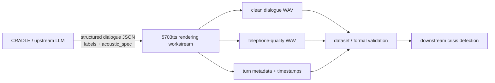
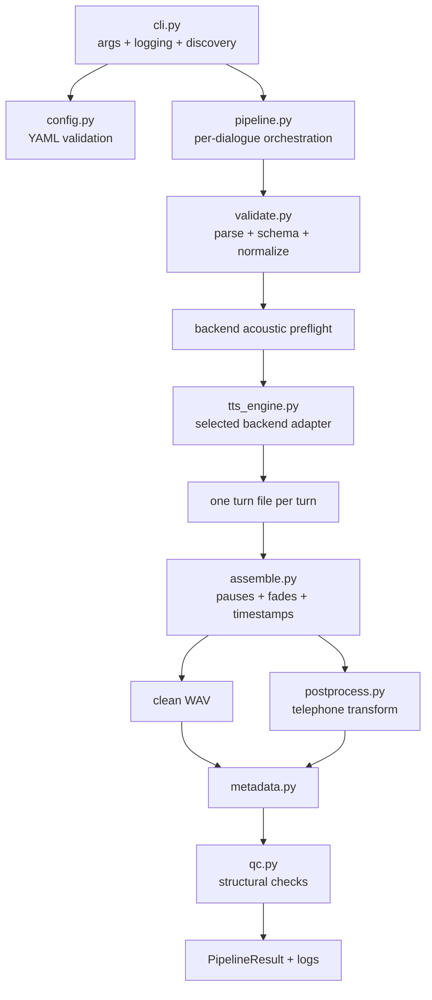
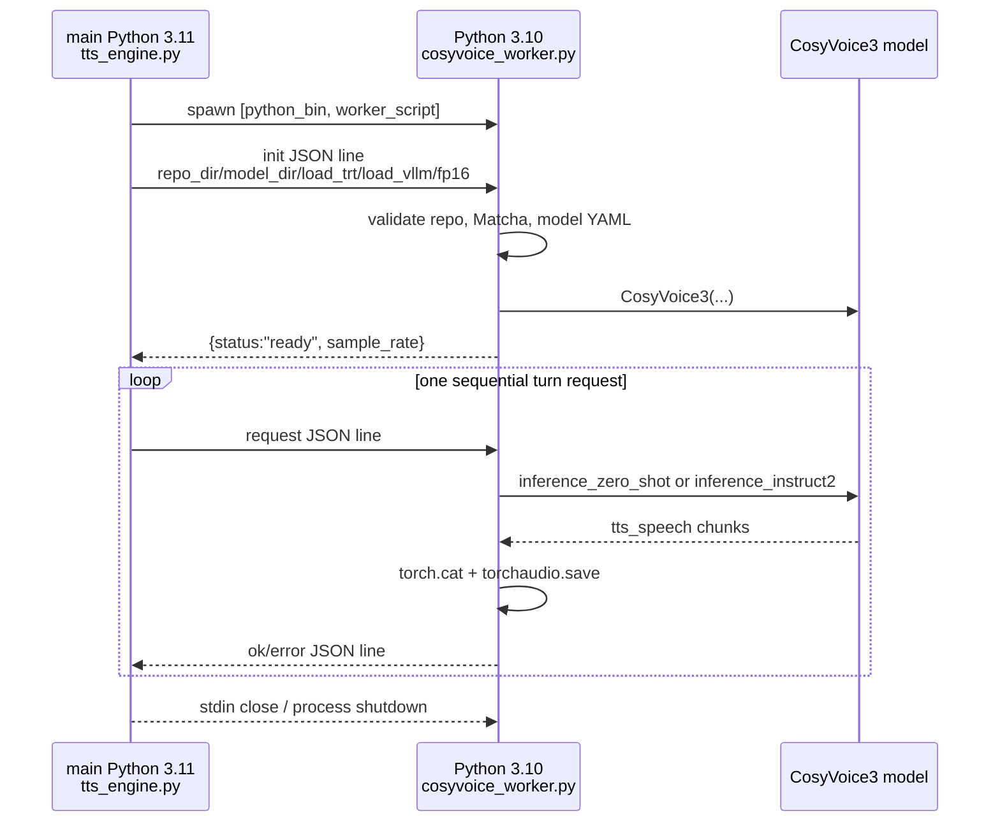
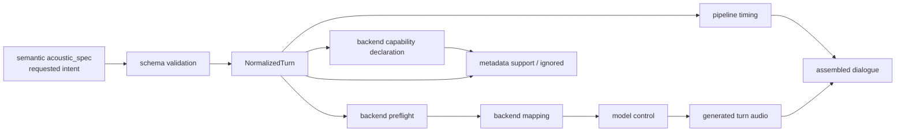
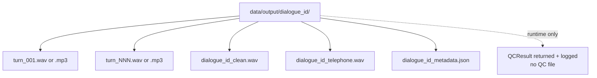
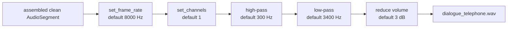

# 5703tts 项目完整讲解

> 本文描述的是仓库提交 `2a235f8e387354055a3b1ac915fbaf4e783ef51d` 的**当前实现**。证据优先级为 `src/tts5703/` → `tests/` → `schemas/` → `config/` → `scripts/` → `pyproject.toml` → README。文中“支持”会区分 schema 接受、backend 映射、真实运行以及声学效果验证，不能互换理解。

## 1. 项目要解决什么问题

CS-28 的上游系统会产生 synthetic crisis dialogue，其中包含逐 turn 的文本、说话角色、危机标签和期望的 acoustic specification。`5703tts` 的职责是把这类结构化输入变成可对齐的语音数据：每个 turn 一份语音、整段 clean dialogue、telephone-quality 版本，以及保留标签和时间戳的 metadata。

它**不是**危机检测器，也不生成危机标签。`label` 只是从输入原样带到 metadata，供下游训练或验证使用。代码中没有 ASR、crisis classifier、label correctness evaluator，也没有把 QC 结果送入下游模型。证据：`src/tts5703/validate.py`、`src/tts5703/metadata.py`、`src/tts5703/qc.py`。

核心对齐单元是：

```text
one dialogue turn
= one turn_id
+ one text
+ one label
+ one requested acoustic specification
→ one generated turn audio unit
→ one speech interval in dialogue metadata
```

这个 invariant 在实现中由唯一且递增的 `turn_id` 检查、`synthesize_all_turns()` 的逐 turn 字典、`assemble_dialogue()` 的同序遍历和 `build_metadata()` 的 `turn_id` 查表共同维持。相关测试是 `tests/test_validation.py` 与 `tests/test_pipeline_compatibility.py`。

## 2. TTS 在完整 CS-28 系统中的位置



这里需要分清两种 validation：

- `validate.py` 做输入 contract/schema validation。
- `qc.py` 做 TTS workstream 的基本输出完整性检查。
- 正式项目 validation（音质、情绪/唤醒度有效性、speaker diversity、telephone realism、下游 crisis-detection usefulness）不在当前主 pipeline 中。

因此 **TTS workstream QC ≠ formal project validation**。

## 3. 当前仓库已经实现到什么程度

当前默认 `config/config.yaml` 选择 `cosyvoice`。仓库有四条 engine 代码路径，但成熟度不同：CosyVoice 和 Kokoro 有 central capability declaration 与 controlled benchmark；EdgeTTS 有可调用代码和已安装依赖，但没有 capability declaration；Chatterbox Turbo 只有实验代码，依赖未列入项目环境。

状态词在本文中的含义：

- **implemented**：主执行路径中有实际代码。
- **configured**：当前 YAML 有值，不代表本机或新 clone 一定可运行。
- **tested**：离线测试验证了软件行为，不代表真实模型音质。
- **provisional**：参数确实传到模型，但映射的声学 fidelity 未充分验证。
- **experimentally supported**：本机 benchmark artefact 显示曾真实运行，但结论仍受实验设计限制。
- **unsupported/deferred**：未被 backend 消费，或明确留待以后。

主要现状：

| 能力 | 当前结论 | 直接证据 |
| --- | --- | --- |
| Canonical model-independent schema | implemented + tested | `schemas/dialogue_schema.json`, `validate.py`, `test_validation.py` |
| Legacy versionless input | temporary compatibility | `_LEGACY_DIALOGUE_SCHEMA`, `_normalize_legacy_turn()` |
| CosyVoice3 synthesis path | implemented/configured；本机有过真实 benchmark | `tts_engine.py`, `cosyvoice_worker.py`, gitignored benchmark results |
| CosyVoice rate | `model_control`；本机 duration direction 有诊断证据 | `rate_to_cosyvoice_speed()`, benchmark results |
| CosyVoice arousal/affect | `provisional_model_control` | instruction mapping + tests；没有 perceptual fidelity score |
| Pause | implemented as `pipeline_timing` | `assemble.py`, timing tests |
| Emotion/events | accepted and preserved, but unsupported | capability registry + metadata tests |
| Two roles | represented and deterministically mapped | voice maps；默认 CosyVoice 两角色却共用同一 prompt WAV |
| Telephone output | implemented basic transform | `postprocess.py` |
| Metadata | implemented per dialogue | `metadata.py` |
| QC | basic runtime result only | `qc.py`；无独立 QC JSON |
| Retry/resume/batch manifest | not implemented | pipeline/CLI 无相应状态机 |

文档与实现有两处容易误读的差异：

1. `config/config.yaml` 第一行注释仍写“Default: online Edge TTS”，实际 `tts.engine: cosyvoice`；实际配置值优先。
2. README 说输出“accompanied by ... QC results”，但主 pipeline 只把 `QCResult` 返回给 CLI 并写入日志；没有独立 QC 文件，也没有把 QC 写进 metadata。

## 4. 一张图理解整个系统



四个最重要的边界是：

```text
schema support
    ≠ backend support
    ≠ empirically validated acoustic fidelity

requested acoustic specification
    ≠ observed acoustic property

TTS model control
    ≠ pipeline timing/post-processing

unit tests passing
    ≠ real model/audio quality validated
```

## 5. Repository 目录结构

分析时忽略了 `.git/`、`.venv/`、`third_party/`、`models/`、`data/output/`、cache、logs 与 generated audio 的树展开。

```text
5703tts/
├── pyproject.toml                 # package、依赖、5703tts console entry
├── uv.lock                        # 锁定的主 Python 3.11 环境
├── README.md                      # 安装和快速使用说明（不是最高证据）
├── config/
│   ├── config.yaml                # 默认 CosyVoice + 其他 backend 配置
│   └── config.kokoro.yaml         # controlled benchmark 的 Kokoro 配置
├── schemas/
│   └── dialogue_schema.json       # canonical schema v0.2
├── src/tts5703/                   # 生产实现
├── scripts/
│   ├── run_controlled_tts_benchmark.py
│   └── analyze_controlled_tts_benchmark.py
├── data/
│   ├── input/                     # 当前 30 个 versionless legacy JSON
│   └── benchmark/                 # fixture、manifest、说明；runs 被忽略
└── tests/                         # 243 个 collected offline test cases
```

`third_party/` 和 `models/` 被 `.gitignore` 完整排除。当前机器确实有 pinned CosyVoice checkout、Python 3.10 环境、prompt WAV 和 model YAML，但 fresh clone 没有这些资产。

## 6. 如何运行项目

`pyproject.toml` 定义：

```toml
[project.scripts]
5703tts = "tts5703.cli:run"
```

正常离线测试：

```bash
uv run --with pytest pytest -q
```

默认 batch：

```bash
uv run 5703tts
```

等价的关键默认值是：

- input：`data/input`，只找该目录**第一层**的 `*.json`，不递归；按路径名排序。
- output：`data/output`。
- config：`config/config.yaml`，当前选择 CosyVoice。
- logs：`logs/run_YYYY-MM-DD.log`，同一天多次运行追加到同一文件。

可用 `--input`、`--output`、`--config`、`--log-dir`、`--verbose` 覆盖。输入为空时记录 warning 并成功返回；配置加载失败会记录 exception 并重新抛出，整个 batch 停止；单个 dialogue 的失败通常封装成 `PipelineResult(status="failed")`，CLI 继续下一个文件。

真实 backend 要求：

- EdgeTTS：主环境已安装 `edge-tts 7.2.8`，每次合成需要在线服务。
- Kokoro：主环境已安装 `kokoro 0.9.4`，首次可能下载模型，之后可依赖本地 cache。
- CosyVoice：另一个 Python 3.10 环境、外部 repo、Matcha-TTS、model snapshot、prompt WAV；GPU 对实用性能很重要。
- Chatterbox：`chatterbox` 当前未安装，选择它会在 lazy import/load 时失败。

### 6.1 Configuration system：`config/config.yaml` 字段说明

配置没有自己的 JSON Schema；`config.py` 做手写且**部分**的 early validation。以下“required”同时考虑后续代码实际索引，而不只看 validator。

**General pipeline / speaker**

| Key | 当前值/用途 | 要求与状态 | Reproducibility |
| --- | --- | --- | --- |
| `speaker_voice_map` | Edge：counsellor→Aria、caller→Guy；Chatterbox validation 也用此 role set | Edge/Chatterbox dialogue 实际需要；当前 validator 不检查 map 本身 | voice identity 关键 |
| `tts.engine` | `cosyvoice` | 必需；四选一 | 决定全部 backend 行为 |
| `tts.default_rate` | `+0%` | validation 每次都读取；只给 legacy 缺省 rate 使用，canonical 默认是代码中的 `normal` | legacy corpus 关键 |
| `pause.default_ms` | `500` | 必需、non-negative；canonical/legacy 缺省 after pause | timeline 关键 |
| `fade_ms` | `5` | optional，assembly 缺省 5；没有 type/range validation | waveform edge 关键 |

**Kokoro-specific**

| Key | 用途 | Validation |
| --- | --- | --- |
| `tts.kokoro.lang_code` | 构造 cached `KPipeline` | selected 时必需 non-empty string |
| `sample_rate` | `soundfile` 写 turn WAV 的 rate | selected 时 positive integer |
| `device` | 传给 `KPipeline`；null 让库选择 | null 或 non-empty string |
| `voice_map` | role→Kokoro voice name | selected 时 non-empty map；每个 key/value non-empty；是否覆盖某 dialogue speaker 在 dialogue validation 检查 |

`config/config.kokoro.yaml` 是 benchmark baseline 的最小配置。Tests 强制它与主 config 的 Kokoro block、default rate、pause、fade、telephone 相同，允许 `tts.engine` 不同。

**CosyVoice-specific**

| Key | 用途 | Required/default |
| --- | --- | --- |
| `python_bin` | 启动隔离 worker | optional string；缺省 `third_party/CosyVoice/.venv/bin/python` |
| `repo_dir` | import CosyVoice + locate Matcha | optional；缺省 `third_party/CosyVoice` |
| `model_dir` | CosyVoice3 snapshot | optional；缺省 `models/Fun-CosyVoice3-0.5B` |
| `load_trt` | worker model acceleration flag | optional bool，缺省 false |
| `load_vllm` | worker model acceleration flag | optional bool，缺省 false |
| `fp16` | worker requested precision | optional bool，缺省 true；无 CUDA 时 upstream 可关闭 |
| `sample_rate` | 仅覆盖 metadata 的 expected value | optional positive integer；不控制 worker output，不是 runtime verification |
| `voice_map.*.prompt_wav` | zero-shot/instruct speaker reference | 每 configured voice 必需 non-empty string；文件到 synthesis 前才查 existence |
| `voice_map.*.prompt_text` | zero-shot reference transcript | 每 configured voice 必需 non-empty string；instruct2 worker 不消费它 |

**Chatterbox-specific**

`device`、`variant`、`model_dir`、`reference_audio_map`、`temperature`、`top_p`、`top_k`、`repetition_penalty` 供 experimental branch 使用。选择该 engine 时 validator 只要求整个 section 存在，不验证这些内部值。`model_dir=null` 会走 `from_pretrained`；reference null 使用 built-in voice。

**Telephone processing**

| Key | 当前值 | 含义/validation |
| --- | ---: | --- |
| `telephone.sample_rate` | 8000 | positive；也是 low-pass Nyquist check 基准 |
| `channels` | 1 | positive number；代码传给 `set_channels`，实际上应为整数但 validator 未强制 integer |
| `high_pass_hz` | 300 | positive 且低于 low-pass |
| `low_pass_hz` | 3400 | positive、低于 Nyquist |
| `volume_db_reduction` | 3 | runtime 必需；validator 没有提前检查 |

Acoustic rate/arousal/affect mappings 不在 YAML，而是 hard-coded 于 `tts_engine.py`；emotion/events 没有 mapping config。Output/log 路径也不在 YAML，由 CLI flags 管理。对可复现运行最关键的是 engine、model/repo 路径与版本、voice/prompt、rate mapping 代码、pause/fade、telephone settings；当前 metadata 只保存其中一部分。

## 7. 输入 JSON/schema 详解

### 7.1 Canonical schema v0.2

根对象必须且只能包含 schema 允许的字段；required 是 `schema_version`、`dialogue_id`、`turns`：

| 字段 | 约束 | 归一化/含义 |
| --- | --- | --- |
| `schema_version` | 必须严格为字符串 `"0.2"` | 只要根对象出现该字段，就走 canonical validator |
| `dialogue_id` | 非空字符串 | 用于输出目录和文件名；当前没有路径安全约束 |
| `turns` | array，至少 1 项 | 保持输入顺序 |
| `turn_id` | integer | 额外代码检查 unique + increasing；schema 没有 minimum |
| `speaker` | 非空字符串 | 必须存在于所选 backend 使用的 voice map |
| `text` | 非空字符串 | 直接发送给 TTS；不做文本规范化或语言验证 |
| `label` | `normal` / `alert` / `confirm` | 原样进入 metadata，不影响声音 |
| `acoustic_spec` | 必需 object；内部字段本身都 optional | 缺失值在 normalization 时补默认 |

`acoustic_spec`：

| 字段 | Schema 约束 | Canonical 默认 |
| --- | --- | --- |
| `rate` | `slow` / `normal` / `fast` | `normal` |
| `pause_before_ms` | integer ≥ 0 | `0` |
| `pause_after_ms` | integer ≥ 0 | `config.pause.default_ms`，当前 500 |
| `arousal` | `low` / `medium` / `high` / `null` | `null` |
| `coarse_affect` | 任意 string 或 `null` | `null` |
| `emotion` | 任意 string 或 `null` | `null` |
| `paralinguistic_events` | array；items 未限制 | `[]` |

注意：`acoustic_spec: {}` 完全合法；`coarse_affect` 和 `emotion` 甚至可以是空字符串，因为 schema 没有 `minLength`；events 可以包含任意 JSON value。Schema 的开放性是输入表达能力，不是模型能力证明。

### 7.2 Legacy compatibility path

没有 `schema_version` 的对象走 `validate.py` 内嵌的 `_LEGACY_DIALOGUE_SCHEMA`。legacy acoustic 字段是 turn 顶层字段：

- `rate` 是形如 `+0%`、`-10%` 的 percentage string。
- 只有 `pause_after_ms`，没有 `pause_before_ms`。
- 可带 `emotion`、`arousal`、`paralinguistic_events`；没有 `coarse_affect`。
- 缺省 rate 来自 `tts.default_rate`；缺省 pause 来自 `pause.default_ms`。
- 归一化后 `pause_before_ms=0`、`coarse_affect=None`。
- 每次使用会记录 “temporarily supported” warning。

当前 `data/input/batch_001.json` 至 `batch_030.json` 全部是 versionless legacy：30 files、133 turns、两个角色、三种标签。也就是说 canonical v0.2 是推荐 contract，但仓库自带 production-like inputs 尚未迁移。

Canonical turn 不能混入 legacy 顶层 `rate` 等字段，因为 `additionalProperties: false`。两条路径最后都变成 `NormalizedTurn`，从此 pipeline 不再看原始 JSON 形状。

### 7.3 对齐 invariant 的代码证据

1. JSON Schema 保证每个 turn 有 `turn_id/speaker/text/label/acoustic_spec`。
2. `validate_and_normalize()` 拒绝 duplicate 和非递增 `turn_id`。
3. `synthesize_all_turns()` 按 turns 顺序调用一次 `synthesize_turn()`，结果用 `turn_id` 作 key。
4. Kokoro 多 chunk 用 `np.concatenate`；CosyVoice 多 chunk 用 `torch.cat`；都写成一个 turn 文件。
5. `assemble_dialogue()` 每个 normalized turn 查找同 id 路径并生成一个 `TurnTiming`。
6. Metadata 再以同一个 `turn_id` 连接 audio path 与 timing。

## 8. 从 JSON 到最终 WAV 的完整执行流程

从 `uv run 5703tts` 开始，准确顺序如下：

1. `tts5703.cli:run()` 调用 `asyncio.run(main())`。
2. `main()` 解析参数，建立 log file 与 console handlers，写 `batch_start`。
3. `load_config()` 读取 YAML 并执行 `_validate_config()`。这是 model-independent 的配置步骤，但验证覆盖并不完整，见第 32 节。
4. `args.input.glob("*.json")` 发现并排序输入；不递归。
5. 对每个文件调用 `await run_dialogue(path, config, output_root)`；dialogues 串行。
6. `pipeline.run_dialogue()` 先以文件 stem 作为临时 `dialogue_id`，便于 parse 失败时报告。
7. `load_and_validate()` 读文本、`json.loads()`，选择 canonical 或 legacy schema。
8. `validate_and_normalize()` 检查 speaker voice availability、turn id uniqueness/order，并输出 `NormalizedDialogue`。这一段不把 acoustic semantics 转成模型参数。
9. `preflight_dialogue_controls()` 对所有 turns 做 backend mapping preflight。当前只有 CosyVoice 检查 arousal/affect mapping；失败发生在 output directory 创建之前，所以不会生成音频。
10. 创建 `output_root/dialogue_id/`。这里没有 staging/temp transaction。
11. `synthesize_all_turns()` 按顺序逐个调用 `synthesize_turn()`。Edge 输出 MP3；其余路径输出 WAV。一个失败会停止本 dialogue，先前文件保留。
12. `assemble_dialogue()` 按 turn 顺序读取文件，先插入当前 `pause_before_ms`，记录 segment start/end，再插入当前 `pause_after_ms`；边缘做短 fade，不做 crossfade。
13. 返回内存中的 `full_audio` 和 `TurnTiming[]`。时间戳单位秒、round 到 3 位，代表 clean timeline 的 speech interval。
14. 先把 `full_audio` export 为 `<id>_clean.wav`。
15. `apply_telephone_effect(full_audio, config)` 从同一 clean waveform 生成 resampled/downmixed/filtered/attenuated copy，再 export `<id>_telephone.wav`。
16. `describe_engine()` 生成 engine configuration snapshot；`build_metadata()` 合并 output names、turn request、support/ignored controls、timestamps；`write_metadata()` 写 JSON。
17. `run_qc()` 检查 turn files、clean/telephone existence、duration、turn count、timestamp order 和 metadata fields。结果只进入 `PipelineResult` 与 log。
18. QC 通过则 `status=success`，否则 `status=failed`。CLI 记录结果后继续下一 dialogue，最后写 batch totals。

Model-independent 阶段：config shell、JSON/schema validation、normalization、pause assembly、telephone processing、metadata/QC。Backend-specific 阶段：voice resolution、control preflight/mapping、真实 synthesis、engine provenance。

异常语义：

- `ValidationError` → expected failed result，无 traceback。
- `BackendControlError` → expected preflight failed result，无 traceback。
- 其他 exception（TTS、文件、audio decode/export、worker 等）→ `Unexpected error` + traceback，保留已生成文件。

## 9. 各 Python 模块逐个讲解

下表同时覆盖 purpose、API、I/O、caller、dependency、side effect、failure、tests 和 pipeline role：

| 模块 | 公开入口；输入 → 输出 | Caller / 依赖 | Side effects / failure modes | 主要测试 |
| --- | --- | --- | --- | --- |
| `cli.py` | `configure_logging()`；`main()`；`run()` | console script → `config`, `pipeline` | 建 log；config failure abort；无输入 warning；per-dialogue failure 继续 | 无专门 CLI test |
| `config.py` | `load_config(Path) → dict` | CLI、benchmark、tests；PyYAML | 读 YAML；`ConfigError` 或未包装的 read/YAML/type error | `test_config_validation.py`, validation tests |
| `validate.py` | `load_and_validate()` / `validate_and_normalize()` → normalized dataclasses | pipeline、benchmark；jsonschema、config engine list | 读 JSON；legacy warning；`ValidationError` | `test_validation.py`, preflight/fixture tests |
| `engine_capabilities.py` | registry queries、request snapshot、ignored list | metadata、benchmark、tests | 纯函数；undeclared engine 抛 `UnknownEngineCapabilityError` | `test_engine_capabilities.py` |
| `pipeline.py` | `run_dialogue() → PipelineResult` | CLI；调用所有 stage | 创建 output、export、metadata；捕获并分类异常；不 rollback | `test_pipeline_error_paths.py` |
| `tts_engine.py` | rate map、preflight、`synthesize_turn()`、`synthesize_all_turns()`、`describe_engine()` | pipeline、benchmark；edge/kokoro/soundfile/subprocess | 网络/model/GPU/worker；写 turn 文件；lazy cache | controls、worker lifecycle、preflight、metadata tests |
| `cosyvoice_worker.py` | executable `main()`；init/request JSON → response JSON | 由 `tts_engine` subprocess 启动；CosyVoice/torch/torchaudio | 加载模型、占 GPU、写 WAV；stderr diagnostics | `test_cosyvoice_worker.py`（fake deps） |
| `assemble.py` | `assemble_dialogue(turns, paths, config) → AudioSegment, timings` | pipeline、benchmark；pydub | 读所有 turn audio；missing/corrupt file 抛异常 | `test_pipeline_compatibility.py`, benchmark runner tests |
| `postprocess.py` | `apply_telephone_effect(AudioSegment, config) → AudioSegment` | pipeline；pydub | 函数自身不写文件；无专门 tests | 间接未充分覆盖 |
| `metadata.py` | `build_metadata() → dict`; `write_metadata() → Path` | pipeline；capability registry | 写 JSON；路径/id/key 错误传播 | production metadata + compatibility tests |
| `qc.py` | `run_qc(...) → QCResult` | pipeline；pydub | 读 turn/clean files；不写 QC report；部分 decode error 会传播 | 无专门 QC test |

`__init__.py` 只导出 `PipelineResult` 和 `run_dialogue`，并解释 distribution `5703tts` 与合法 Python package name `tts5703` 的差别。

## 10. TTS Engine abstraction

当前 abstraction 不是 abstract base class 或 plugin system，而是 `synthesize_turn()` 内的四路 branch。统一 contract 是：

```text
NormalizedTurn + out_dir + config
    → await synthesize_turn(...)
    → Path to exactly one turn audio file
```

共同逻辑：

- `get_engine()` 从 `tts.engine` 选路。
- `turn_audio_extension()` 说明 Edge 为 `.mp3`，其他为 `.wav`。
- schema semantic rate 在 backend boundary 映射。
- pause 不进入任何 backend branch，由 `assemble.py` 统一实现。
- `synthesize_all_turns()` 串行执行，适配 stateful model 和单一 CosyVoice stdio channel。

没有共同 interface 对输出 sample rate/channel、actual controls 或 worker timing 作结构化返回；只有 `Path`。这正是 CosyVoice runtime sample rate 无法进入 production metadata 的原因之一。

Central registry 只声明 CosyVoice 与 Kokoro。Edge/Chatterbox 虽然 code exists，但 metadata 的 `control_support` 和每 turn 的 `ignored_requested_controls` 都是 `null`，意思是“没有声明”，不是“什么都没忽略”。

## 11. CosyVoice3 深度讲解

### 11.1 为什么隔离环境

主项目要求 Python ≥3.11；CosyVoice 使用自己的 Python 3.10 `.venv` 与 pinned dependencies。代码不在主进程 import CosyVoice，而由 `tts.cosyvoice.python_bin` 启动 `src/tts5703/cosyvoice_worker.py`。这避免依赖冲突，也让外部 checkout/model 保持 gitignored。

当前本机检查到：

- main Python `3.11.16`；worker Python `3.10.21`。
- CosyVoice checkout commit `074ca6dc9e80a2f424f1f74b48bdd7d3fea531cc`。
- `third_party/CosyVoice/third_party/Matcha-TTS` 与 model `cosyvoice3.yaml` 存在。
- 这些均不是仓库追踪内容。

上游接口信息来自本机 pinned checkout；外部对应源码为 [QwenAudio/CosyVoice `074ca6dc`](https://github.com/QwenAudio/CosyVoice/tree/074ca6dc9e80a2f424f1f74b48bdd7d3fea531cc)。仓库自己的调用方式仍以 `cosyvoice_worker.py` 为准。

### 11.2 进程和协议



JSON-lines stdout 是 protocol 专用；worker 用 `redirect_stdout(sys.stderr)` 包裹第三方 initialization 和 synthesis，避免 progress text 污染 JSON。主进程另起 daemon thread 持续 drain stderr，并保留最后 50 行诊断，避免 pipe 填满导致 batch deadlock。

### 11.3 Worker lifecycle

- `_get_cosyvoice_worker()` 用 `lru_cache(maxsize=1)`，同一组参数通常只加载一次模型并跨 turns/dialogues 复用。
- startup 没有显式 timeout；`readline()` 可无限等候。
- startup empty/malformed/non-`ready` response 变为 `RuntimeError`；部分路径 kill worker，但 startup cleanup 没有完整 wait/reap guarantee。
- request 前发现 worker 已退出：清 cache，报告 stderr tail。
- request 收到 EOF：关闭 stdin，terminate，最多等 5 秒，再 kill/reap，然后清 cache。
- malformed request response：抛 `RuntimeError`；当前代码不清 cache，也没有对应 lifecycle test。
- worker 内某 turn synthesis exception：打印 traceback 到 stderr，返回 `{status:"error"}`，worker loop 继续；主进程将当前 dialogue 标为 unexpected failure，下一 dialogue 可复用 worker。
- `atexit` shutdown 是 best effort：close stdin + terminate，不包含完整 wait/kill 流程。
- protocol 没有 request id、锁或并发 routing，因为 production synthesis 当前串行；不要在未重设协议时并发调用。

### 11.4 Startup/loading 与缺失资产

主进程每次 Cosy turn 前检查 worker script、Python executable、repo dir、model dir、prompt WAV 是否存在。Worker 再检查：repo directory、`third_party/Matcha-TTS`、model directory、`cosyvoice3.yaml`。缺任何一项都给出具体路径并失败。

Worker 把 Matcha 和 repo 插到 `sys.path`，import `CosyVoice3`，然后传入：

- `model_dir`
- `load_trt`，当前 `false`
- `load_vllm`，当前 `false`
- `fp16`，当前 `true`

Pinned upstream 在无 CUDA 时会把 TRT/fp16 关闭并 warning；这来自外部 checkout，不是本仓库自己的 fallback logic。`fp16: true` 因此是 requested load configuration，不保证实际 runtime precision。

### 11.5 Prompt/reference 与 synthesis mode

每个 speaker voice entry 必须有非空 `prompt_wav` 和 `prompt_text`。路径相对 repository root 解析。

- 没有 explicit arousal/coarse affect instruction：`mode="zero_shot"`，worker 要求 `prompt_text`，调用 `inference_zero_shot(text, prompt_text, prompt_wav, stream=False, speed=...)`。
- 有任一 provisional control：`mode="instruct2"`，builder 创建必须且只包含一个、位于末尾的 `<|endofprompt|>` instruction；worker 调用 `inference_instruct2(text, instruction, prompt_wav, stream=False, speed=...)`。这个路径不使用 request 中的 `prompt_text`。

默认 caller 与 counsellor 都指向同一个 `zero_shot_prompt.wav` 和同一 transcript；所以技术上能渲染两个 role，声音身份却默认相同。**technical two-speaker smoke test ≠ production-ready speaker pool**。

### 11.6 Output 与 sample rate

Worker 把所有 `tts_speech` chunk detach/cpu 后在 dimension 1 拼接，用 `model.sample_rate` 写 WAV，并在 response 中返回 `sample_rate`、`samples`、`mode`、`speed`。

主进程只检查 `status`，`synthesize_turn()` 只返回 Path；response 的 runtime sample rate 未进入 metadata。`describe_engine()` 因此记录：

- `expected_sample_rate=24000`（model default）或可选 config override；
- `expected_sample_rate_source=config|model_default`；
- `runtime_sample_rate=null`；
- `sample_rate_verification="not_runtime_verified"`。

“expected” 不能解释为实际 WAV 的测量值。Worker startup 和 turn response 都报告 sample rate，但 production metadata 当前没有传递它；QC 也不读取 sample rate 验证。

### 11.7 Reproducibility metadata

CosyVoice metadata 保留 model label、mode list、provisional mapping flag、repo/model paths、fp16/TRT/vLLM flags，以及每角色 prompt WAV/text。它没有保留 `python_bin`、CosyVoice commit、model snapshot revision/hash、依赖版本、seed、GPU/CUDA 信息、config hash 或 audio hash。因此是有用但不完整的 provenance。

## 12. EdgeTTS / Kokoro / 其他 backend

| Backend | Code exists | Dependency available | Local/online | Turn output | Rate | Pause | Arousal | Affect | Emotion | Paralinguistics | Current role |
| --- | --- | --- | --- | --- | --- | --- | --- | --- | --- | --- | --- |
| CosyVoice3 | 是 | 隔离环境/资产本机存在；fresh clone 无 | local model | WAV，worker model rate | `model_control`, 0.8/1.0/1.2 | `pipeline_timing` | `provisional_model_control` | `provisional_model_control`，仅 neutral/distressed mapping | `unsupported` | `unsupported` | 默认配置、主要实验 candidate |
| Kokoro | 是 | 主环境已安装 0.9.4 | initial download 后 local cache | WAV，configured 24 kHz | `model_control`, 0.8/1.0/1.2 | `pipeline_timing` | `unsupported` | `unsupported` | `unsupported` | `unsupported` | lightweight local baseline / benchmark |
| EdgeTTS | 是 | 主环境已安装 7.2.8 | online | MP3 | 实际传 `rate`；但 registry 未声明 | assembly 可实现 | 未传模型；registry 未声明 | 未传模型；registry 未声明 | 未传模型；registry 未声明 | 未传模型；registry 未声明 | online fallback/code path；metadata capability incomplete |
| Chatterbox Turbo/Nano | 是 | **未安装**、不在 dependencies | local cache 或 pretrained download，取决配置 | WAV at `model.sr` | turn rate 未传给 model | assembly 可实现 | 未传模型 | 未传模型 | 未传模型 | 未传模型 | retained experimental path，不宜视为 supported production backend |

EdgeTTS 用 project-level `speaker_voice_map`，当前 Aria/Guy；`Communicate(..., rate=...)` 后在线保存 MP3。没有真实 Edge tests。

Kokoro lazy-load `KPipeline(lang_code, device)`，同 `(lang_code, device)` cache；每个 generator result 的 `audio` 转 numpy，全部 concatenate 后由 `soundfile` 按 config sample rate 写 WAV。没有真实 Kokoro model test，但本机 gitignored benchmark 显示曾完成真实 run。

Chatterbox lazy import `ChatterboxTurboTTS`；可 `from_local` 或 `from_pretrained`，生成参数是 temperature/top-p/top-k/repetition penalty，optional speaker reference。当前 config 的两个 reference 都为 null，会使用 bundled voice，无法保证 role distinguishability；config validator 也只检查 section 存在，没有逐字段验证。

## 13. Acoustic Specification 完整控制链



逐字段总表：

| Field | Schema accepted/validated | CosyVoice consumes | Kokoro consumes | 实现位置 | Model itself? | 可忽略/如何报告 | Fidelity evidence |
| --- | --- | --- | --- | --- | --- | --- | --- |
| `rate` | enum | 是，numeric `speed` | 是，numeric `speed` | `tts_engine.py` | 是 | 声明为 `model_control`，不忽略 | tests + real-run duration direction diagnostic；非 perceptual proof |
| `pause_before_ms` | int ≥0 | 不传 | 不传 | `assemble.py` | 否，`pipeline_timing` | 不列 ignored，因为 pipeline honor | deterministic timing tests + benchmark diagnostic |
| `pause_after_ms` | int ≥0 | 不传 | 不传 | `assemble.py` | 否，`pipeline_timing` | 同上 | 同上 |
| `arousal` | enum/null | instruction mapping | 否 | `build_cosyvoice_instruction()` | Cosy：是但 provisional | Kokoro 列 ignored；Cosy 不列 ignored | mapping/protocol tests；descriptive metrics，不足以验证 fidelity |
| `coarse_affect` | open string/null | neutral/distressed instruction | 否 | preflight + instruction builder | Cosy：是但 provisional | unmapped Cosy 值 preflight fail；Kokoro ignored | mapping tests；descriptive only |
| `emotion` | string/null | 否 | 否 | 只 normalize/metadata | 否 | non-null 时列 ignored（declared engines） | 无 |
| `paralinguistic_events` | arbitrary array | 否 | 否 | 只 normalize/metadata | 否 | non-empty 时列 ignored | 无 |

这里必须同时记住：

- **Schema support ≠ backend support**：例如 `coarse_affect: "anxious"` 可过 schema，却在 CosyVoice preflight 失败。
- **Backend support ≠ validated fidelity**：instruction 被传入不等于声音一定有目标 arousal。
- **Requested spec ≠ observed property**：metadata 记录请求，没有 waveform estimator 回填 observed arousal/affect。
- **Model control ≠ pipeline timing**：pause 完全不进模型，但仍可被 deterministic honor。

## 14. rate 是如何实现的

Canonical rate 是 semantic enum；legacy 是 signed percentage。映射在 backend boundary：

| Requested | EdgeTTS | Kokoro | CosyVoice |
| --- | --- | --- | --- |
| `slow` | `-20%` | `speed=0.8` | `speed=0.8` |
| `normal` | `+0%` | `speed=1.0` | `speed=1.0` |
| `fast` | `+20%` | `speed=1.2` | `speed=1.2` |
| legacy `±N%` | 原样 | `max(0.1, 1 + N/100)` | 同 Kokoro |

Kokoro/Cosy legacy conversion 使用 `int(rate[:-1])`；非法 percentage 应在 legacy schema 被挡住。Semantic maps 是固定代码，不从 YAML 配置。

能力 registry 把 CosyVoice/Kokoro rate 标为 `model_control`。Controlled fixture 固定 text/speaker/label/其他 acoustic fields，只改 slow/normal/fast；runner 记录 end-to-end RTF 与 duration，并检查 `slow duration > normal > fast`，但该检查明确是 `diagnostic_only`。本机当前提交的 gitignored CosyVoice/Kokoro run 都匹配方向；这说明参数路径和 duration direction 有实验迹象，不证明自然度、精确 rate 或 perceptual fidelity。

Edge 的 semantic mapping 有 unit tests，但 Edge 不在 controlled benchmark supported engines，registry 也没有 Edge declaration。

## 15. pause 是如何实现的

Pause 是 `pipeline_timing`，不进入任何 TTS model request。

对 turn *i*：

1. 先把 `pause_before_ms(i)` silence append 到累计 audio。
2. 令 `start_i = current_length`。
3. append speech segment，令 `end_i = new_length`。
4. append `pause_after_ms(i)` silence。

因此相邻 speech gap 是：

```text
gap_before(i) = pause_after_ms(i-1) + pause_before_ms(i)
```

首 turn gap 只有自己的 `pause_before_ms`；末 turn 的 `pause_after_ms` 留在 clean WAV 尾部，但不进入末 turn `end_time`。Silent segments 也做 fade，不过 fade 不改变 duration。

这条路径有 deterministic tests 和 benchmark `pause_diagnostic`。它证明 timeline duration 被实现，而不是模型学会了停顿式 prosody。句内 pause、breath timing、hesitation 都没有实现。

## 16. arousal 是如何实现的

Schema 接受 `low|medium|high|null`。CosyVoice preflight 接受同样三值，映射为：

- low → `Use a calm, soft, subdued delivery.`
- medium → `Use a neutral, moderately expressive delivery.`
- high → `Use an energetic, intense delivery.`

只要非 null，就组装完整 instruct2 instruction 并切换到 `inference_instruct2`。这是真实 model-boundary control，因此不是“完全没实现”；但 registry 特意称为 `provisional_model_control`，因为英文 instruction 到实际 prosody 的映射没有通过听测或 validated arousal estimator 证明。

Kokoro 不消费 arousal，仍生成音频并把非 null 请求列进 `ignored_requested_controls`。Edge/Chatterbox 也不传 arousal，但因没有 declaration，metadata 对 ignored 状态只能给 `null`。

Benchmark 有 low/high controlled pair，analysis 只算 duration、RMS、peak、silence proportion；F0 为 `null`。出现描述性差异也不能作为 arousal fidelity score。

## 17. coarse_affect 是如何实现的

Schema 有意允许任意 string/null，使 upstream ontology 不被一个 backend 限制。当前 CosyVoice mapping 只有：

- `neutral` → `Use a neutral, composed tone.`
- `distressed` → `Use a distressed, worried, and sad tone.`

其他 schema-valid 值（如 `anxious`）在 `preflight_dialogue_controls()` 中产生 `BackendControlError`，并标明 offending turn；由于 preflight 在 output directory 创建前，整段不会开始合成。

映射成功时走 instruct2，capability 是 `provisional_model_control`。与 arousal 同时请求时，两句 instruction 按 arousal 后 affect 的固定顺序拼接，并只有一个 end marker。当前没有 interaction calibration：例如 “high + distressed” 是否互相冲突没有验证。

Kokoro 接受但完全忽略任意 coarse affect，并通过 metadata 明示。Controlled benchmark 只有 neutral/distressed pair，结果仍是 descriptive only。

## 18. emotion / paralinguistic_events 当前状态

`emotion` 和 `paralinguistic_events` 的**数据携带**已经实现：schema 接受、normalization 保存、`TurnTiming` 复制、metadata 同时写 flat field 与 `requested_acoustic_spec`。

它们的**声音控制**没有实现：

- CosyVoice/Kokoro capability 均为 `unsupported`。
- non-null emotion 或 non-empty events 会出现在 `ignored_requested_controls`。
- empty events 与 null emotion 视为“没有请求”，不会误报 ignored。
- `synthesize_turn()` 的四个 backend branch 都不把它们传给模型。
- benchmark fixture 为避免 confound，把 emotion 全设 null、events 全设 `[]`。

因此 fine-grained emotion 与 complex paralinguistic events 当前是 deferred/best-effort representation，不能因为 JSON 有字段就说已实现。

## 19. Speaker / Voice 管理

内部没有独立 `Speaker` class、speaker ID registry、pool sampler 或 assignment manifest。`speaker` 只是输入 turn 的字符串，validation 根据所选 backend 找 voice map：

- EdgeTTS：project-level `speaker_voice_map`。
- Kokoro：`tts.kokoro.voice_map`。
- CosyVoice：`tts.cosyvoice.voice_map`，每项含 `prompt_wav` + `prompt_text`。
- Chatterbox：validation 使用 project-level map；synthesis 另查 optional `reference_audio_map`。

当前两个角色是 `caller` 与 `counsellor`。同一 config 下，role→voice 映射是 deterministic，且跨 dialogues 重复使用相同配置，因此有最低程度的配置可复现性。但这不是“为每个合成 persona 分配持久 speaker identity”：没有 pool index、seed、dialogue-to-speaker assignment 或 identity metadata。

| 项目要求 | 分类 | 当前证据与解释 |
| --- | --- | --- |
| caller/counsellor 表示 | implemented | 输入 speaker + backend voice maps |
| 两角色可区分 | partial / configuration responsibility | Edge/Kokoro 默认 voice 不同；CosyVoice 默认两个 role 使用同一 prompt，实际不区分 |
| reasonably large speaker pool | not implemented | 没有 pool 数据结构或 selection algorithm |
| cross-dialogue identity reuse | partial | 固定 role mapping 会重复 voice；没有多个 identity 的显式 reuse contract |
| reproducible assignment | partial | 静态 YAML deterministic；没有 seed/assignment manifest/hash |
| diversity | not implemented by pipeline | 只能由外部提供不同 voice/reference 并改 config；无采样或平衡逻辑 |

CosyVoice reference clip 的 license、音质、语言匹配、exact transcript 和 speaker consent 都是外部/configuration responsibility；validator 只检查字符串非空，synthesis 前只检查文件存在。

## 20. Dialogue Assembly

`assemble_dialogue(turns, turn_audio_paths, config)` 严格按 normalized turn list 处理，不依赖 path dictionary 的 insertion order。

每个 speech file 用 `AudioSegment.from_file()` 读取，再执行 `fade_in(fade_ms).fade_out(fade_ms)`；当前 `fade_ms=5`。代码使用 `audio + segment` direct concatenation。没有 `append(..., crossfade=N)`，因为 crossfade 会让后一个 turn 提前 N ms 开始，累积破坏时间戳和“一段 speech 不重叠”的约束。

重要特性：

- fade 只改变边缘 amplitude，不改变 segment length。
- pause 是 silence segment，同样 direct append。
- 没有 crossfade、overlap、mixing、background noise 或 two-channel spatial rendering。
- 没有显式统一 clean sample rate/channel/sample width；pydub 在拼接时处理 segment compatibility，实际 clean properties 取决于输入 backend audio。QC 不验证这些 properties。
- Edge turn MP3 需要 pydub/FFmpeg decode；其他 turn 是 WAV。
- 最终 clean 与 telephone 都 export 为 WAV。
- turn files 被保留，不是临时文件，也不会在成功后清理。

这些选择优先保证 downstream turn-label alignment，而不是模拟自然重叠对话。

当前每个 dialogue 的文件/运行结果结构是：



## 21. Timestamp Alignment

`start_time` 在当前 `pause_before` 已插入、speech append 之前取得；`end_time` 在 speech append 后取得。两者 round 到毫秒精度（三位小数），以 clean assembled audio 起点为 0。

具体三 turn 例子，假设每个 speech 分别 100、200、150 ms：

| Turn | pause_before | speech | pause_after | start | end | 累计长度（含 after） |
| --- | ---: | ---: | ---: | ---: | ---: | ---: |
| 1 | 50 | 100 | 200 | 0.050 s | 0.150 s | 350 ms |
| 2 | 75 | 200 | 25 | 0.425 s | 0.625 s | 650 ms |
| 3 | 0 | 150 | 300 | 0.650 s | 0.800 s | 1100 ms |

Turn 2 的 start 是 `50 + 100 + 200 + 75 = 425 ms`；Turn 3 的 gap 来自 turn 2 的 25 ms after。Final clean WAV 是 1.100 s，但最后 speech `end_time` 是 0.800 s，余下 300 ms 是 trailing pause。

QC 检查相邻 turn `start_time >= previous end_time` 和 `end_time > start_time`，并检查最后 end 不超过 clean duration + 50 ms。它不测量 waveform 中真实 speech onset/offset；时间戳是 construction-time boundaries，包括 fade 区间，并非 VAD observation。

## 22. Telephone-quality Audio



实际实现只有 `postprocess.apply_telephone_effect()` 中的 resampling、mono conversion、high-pass、low-pass 和 volume reduction。Config validator 保证 high-pass < low-pass < Nyquist、rate/channels/filter values positive。

没有实现：G.711/AMR codec、quantization/companding、packet loss、jitter、clipping、line/background noise、room impulse response、device microphone response或随机 channel variation。文件名中的 “telephone” 应理解为 basic telephone-band treatment，不是完整电话网络 simulation。

保留两份 audio 的理由：clean 是 synthesis/assembly master，适合检查模型输出与做可控实验；telephone copy 是面向更接近危机热线 channel 的下游输入。**Clean-audio generation ≠ telephone simulation**，两者不能互相替代。

当前 QC 只检查 telephone file 存在，不检查它可读、8 kHz、mono、频带或相对 clean duration。Postprocess 也没有专门 unit test。

## 23. Metadata / Manifest / Provenance

每个成功到 metadata stage 的 dialogue 写 `<dialogue_id>_metadata.json`：

```text
dialogue metadata
├── dialogue_id
├── clean_audio
├── telephone_audio
├── tts
│   ├── engine/model/config snapshot
│   └── control_support
└── turns[]
    ├── identity/content: turn_id, speaker, text, label
    ├── file/alignment: turn_audio, start_time, end_time
    ├── legacy-compatible flat acoustic fields
    ├── requested_acoustic_spec
    └── ignored_requested_controls
```

### 23.1 Requested intent 与 runtime facts

`requested_acoustic_spec` 是 `TurnTiming` 的七个控制字段 snapshot。Flat `rate/pause/...` 为 backward-compatible duplicate，测试要求两者完全相同。它们描述的是**请求**，不是音频测量结果。

`tts.control_support` 描述 backend 的声明：CosyVoice/Kokoro 有完整 map；Edge/Chatterbox 是 `null`。`ignored_requested_controls` 只列 `unsupported` 且实际 non-null/non-empty 的请求；pipeline pause 不列，因为 assembly honor 了它；provisional controls 也不列，因为它们确实被送给 CosyVoice。

容易误解的字段：

- `rate`：requested semantic/legacy value，不是 measured words per minute。
- `arousal`/`coarse_affect`：requested category，不是 classifier observation。
- `start_time/end_time`：construction boundary in clean audio，不是 VAD estimate，也不直接描述 telephone sample positions。
- Kokoro `sample_rate`：pipeline 写 WAV 时使用的 configured value。
- CosyVoice `expected_sample_rate`：declaration，**不是**实际 output measurement。
- CosyVoice `control_mapping="provisional"`：映射存在但 fidelity 未验证。
- `ignored_requested_controls=null`：capability undeclared，不等于没有忽略。

### 23.2 Backend provenance 内容

- Edge：engine + role voice names。
- Kokoro：engine、hard-coded model label `Kokoro-82M`、configured sample rate、voice map。
- CosyVoice：engine、hard-coded model label、available modes、provisional marker、repo/model paths、fp16/TRT/vLLM、expected/runtime sample-rate semantics、prompt WAV/text。
- Chatterbox：variant-derived model label、device、reference map、generation parameters。

### 23.3 缺失的 production provenance

当前没有 corpus/batch manifest，也没有 serialised QC。Production metadata 还缺：主 repo commit、external repo commit、model revision/hash、config snapshot/hash、package versions、Python/CUDA/GPU、random seed、input hash、output audio hash、run timestamp、worker response sample rate、actual channel/sample rate、speaker pool assignment/license。Benchmark results 比 production metadata 多记录 platform/Python/git commit，但也不是 production manifest。

## 24. QC 与错误处理

`run_qc()` 当前 checks：

| Check key | 实际检查 |
| --- | --- |
| `turn_audio_files_exist` | 每 input turn 在 metadata 存在、对应 file 存在且 pydub 可读；duration `<0.1s` 失败（恰好 0.1s 会通过，issue 文本却说 must exceed 0.1） |
| `clean_audio_exists` | path existence |
| `telephone_audio_exists` | path existence only |
| `duration_positive` | clean 可读、duration >0、final speech end 不超过 duration+0.05 |
| `turn_count_matches` | metadata turns 数量等于 normalized turns |
| `timestamps_increasing` | 不重叠且每段 end > start |
| `metadata_fields_complete` | 每 turn 有 `turn_id/speaker/text/label/start_time/end_time` |

QC 不做 audio intelligibility、clipping、silence ratio、SNR、speaker identity、label alignment correctness、sample-rate/channel、telephone spectrum、emotion/arousal、ASR、perceptual listening 或 downstream validation。

Failure/cleanup 语义：

- JSON syntax/schema/speaker/order failure：输出目录尚未创建。
- Cosy mapping preflight failure：所有 turns 已检查前不会生成 audio；输出目录也未创建。
- TTS failure：当前 dialogue 停止，之前 turn files 保留；没有 automatic cleanup。
- Missing/corrupt turn 在 assembly 会抛异常；在 QC 中 corrupt turn 会转 issue。
- Clean export 成功而 telephone/metadata/QC 失败时，已有 clean/turn files 保留。
- Metadata 在 QC 之前写，因此 QC failed 仍可能留 metadata；但 metadata 不含 QC status。
- CLI 的下一 dialogue 继续；config load failure 则 abort batch。
- 没有 retry、backoff、resume、skip-existing、atomic rename 或 checkpoint protocol。
- 重跑同一 `dialogue_id` 会覆盖同名文件，且较旧多余 turn files 可能留在目录。

日志包含 batch/stage/turn lifecycle；verbose 才在 console 显示 DEBUG，但 log file 总是 DEBUG。Unexpected exception 带 traceback；expected validation/preflight warning 不带 traceback。

相关 tests：`test_pipeline_error_paths.py`、`test_backend_preflight.py`、`test_cosyvoice_worker_lifecycle.py`、benchmark runner 的 partial failure tests。没有 production success path 的完整 mock end-to-end test，也没有 `qc.py` 专门测试文件。

## 25. Test Suite 完整讲解

修改前 baseline：`243 passed, 0 skipped, 1 warning`。唯一 warning 是 pydub import Python `audioop`，该模块计划在 Python 3.13 移除。全部 tests 在约 1 秒内完成，说明它们刻意避免真实 heavyweight model。

| Test file | Component | Behaviour verified | Real model required? | Main risk covered |
| --- | --- | --- | --- | --- |
| `test_validation.py` | schema/normalization | canonical/legacy、defaults、labels、rate/arousal、turn ids、speakers、non-mutation | 否 | input contract drift |
| `test_config_validation.py` | config | Kokoro value checks、shared config equivalence | 否 | fail-late/mismatched baseline config |
| `test_engine_capabilities.py` | registry | vocabulary、copy isolation、ignored semantics | 否 | production/benchmark reporting drift |
| `test_backend_preflight.py` | mapping preflight | open schema vs Cosy mapping、before-worker failure | 否 | partial render from unmapped controls |
| `test_pipeline_compatibility.py` | adapters/assembly/metadata | Edge/Kokoro rate maps、legacy rate、pause timeline、request preservation | 否，synthetic WAV | compatibility/alignment regressions |
| `test_pipeline_error_paths.py` | orchestration failure | expected vs unexpected logs/results、no output after preflight | 否，mock synthesis | error classification |
| `test_production_control_metadata.py` | provenance | requested/ignored/support、Cosy config、sample-rate wording | 否 | intent incorrectly presented as fact |
| `test_cosyvoice_controls.py` | Cosy adapter | speed/instruction/mode/request shape、mock worker call | 否 | incorrect control translation |
| `test_cosyvoice_worker.py` | worker protocol | fake Cosy/torch/torchaudio、stdout isolation、zero-shot/instruct/error | 否，fake dependencies | JSON protocol/API wiring |
| `test_cosyvoice_worker_lifecycle.py` | subprocess cleanup | EOF, terminate, kill, reap, cache-clear races | 否，fake Popen | leaked worker/GPU process |
| `test_benchmark_fixture.py` | experiment design | canonical 11 turns、five groups、one-variable control | 否 | confounded benchmark fixture |
| `test_benchmark_runner.py` | benchmark runtime | manifest validation、fake synthesis、RTF、pause、partial persistence、capabilities | 否，mock model | invalid/irreproducible benchmark logic |
| `test_benchmark_acoustic_analysis.py` | signal descriptors | duration/RMS/peak/silence、group comparisons、errors | 否，synthetic WAV | misleading analysis/report structure |

Passing suite **does prove**：schema/normalization rules、deterministic mappings、worker JSON protocol against fakes、worker cleanup branches、non-overlapping timestamp arithmetic、metadata semantics、benchmark controlled-design checks和 error classification 与测试一致。

Passing suite **does not prove**：真实 CosyVoice/Kokoro/Edge loading、GPU/CUDA compatibility、网络可用、reference voice quality、audio naturalness/intelligibility、speaker distinguishability、rate numerical accuracy、arousal/affect perceptual fidelity、telephone realism、large corpus stability、downstream crisis-detection benefit。**Software correctness ≠ TTS acoustic fidelity**。

## 26. Controlled Benchmark

Benchmark v0.1 有 11 个 canonical turns 和 5 groups：rate 3 条，pause-before/pause-after/arousal/coarse-affect 各 2 条。Manifest 为每组声明 `target_variable`、turn IDs、baseline 和 expected conditions。

核心 controlled-variable philosophy：组内必须保持 text、speaker、label 与所有 non-target acoustic fields 完全相同，只改变一个 target。否则观察到的 duration/energy/听感差异无法合理归因于该控制变量。Runner 在 synthesis 前验证：每 turn 恰属一组、condition 匹配、target 真变化、无 top-level 或 acoustic confound。

`run_controlled_tts_benchmark.py`：

- 只允许 `cosyvoice`、`kokoro`，复用 production capability registry 和 production control mapping。
- 默认先用 rate baseline turn warm-up 一次；可 `--no-warmup`。
- 11 observations 顺序串行；每 turn 的 wall time 包住整个 `synthesize_turn()`。
- `RTF = generation_elapsed_sec / audio_duration_sec`，包含 IPC、frontend、inference、file writing，不是纯 GPU inference。
- 每 turn 后立刻写 `benchmark_results.json`；失败保留 partial observations/files。
- 完成后 assembly `benchmark_clean.wav` 并按 timeline 计算 pause diagnostic。
- rate direction 只作 non-binding diagnostic；unsupported groups 明确写 “not evidence of controllability”。

`analyze_controlled_tts_benchmark.py`：

- 只聚焦 rate、arousal、coarse affect 的 turn WAV。
- 测 duration、全 samples/channels RMS、peak、20 ms frames 在 -40 dBFS 以下的 silence proportion。
- rate 算 relative-to-normal 和 slow/normal 分离 warning。
- F0/pitch 明确 omitted，因为项目没有 declared lightweight extractor。
- arousal/affect 只做 descriptive comparison，没有 fidelity score。

Pause 已由 assembly diagnostic 精确验证，analysis 不把它当 speech prosody。Benchmark v0.1 不评估 fine emotion、events、speaker diversity、telephone degradation 或 downstream usefulness。

本机 gitignored runs 显示 CosyVoice 与 Kokoro 均曾完成 11/11；当前提交的 run 记录 rate direction match 和 pause diagnostic。Cosy arousal/affect durations 有差异，但这不是 validated fidelity。本轮没有重跑真实模型或重新生成 corpus。

## 27. 一条真实 dialogue 的生命周期

假设 `data/input/batch_001.json`：这是 versionless legacy，5 turns。

1. CLI 发现文件，日志 id 初始为 `batch_001`。
2. Legacy schema 验证每 turn 的 percentage `rate`、pause、speaker/text/label；发 temporary warning。
3. 每 turn 归一化：`pause_before=0`、`coarse_affect=None`，缺省字段补齐。
4. 默认 CosyVoice voice map 确认 caller/counsellor 均配置；legacy 没有 mapped arousal/affect，preflight 通过。
5. 创建 `data/output/batch_001/`。
6. 第一 turn request 解析相对 repo/model/prompt/python paths，启动并初始化 worker；之后 turns 复用。
7. 每 turn 的 percentage rate 转 speed；没有 arousal/affect 时走 zero-shot，输出 `turn_001.wav` ... `turn_005.wav`。
8. Assembly 依次加入 400/600/500/800/400 ms `pause_after`；没有 pause_before；每段 speech 加 5 ms edge fades。
9. Export `batch_001_clean.wav`。
10. 从 clean 派生 `batch_001_telephone.wav`。
11. Metadata 写 legacy percentage request、labels、prompts、capabilities、turn paths 和 clean speech intervals。
12. QC 做结构检查；结果写 log/返回 CLI，不单独写文件。
13. CLI 汇总 success/failed，并继续 `batch_002.json`。

若 turn 4 synthesis 失败，turn 1–3 文件仍在目录；不会 assembly、metadata 或自动 resume。下一次从 turn 1 重跑并覆盖同名文件。

## 28. 当前项目能做什么

- 接受 canonical v0.2 或 temporary legacy dialogue JSON。
- 验证结构、标签、turn order/uniqueness 与 configured voice availability。
- 在四条代码路径中选择 backend；默认 CosyVoice，Kokoro 为受控 baseline。
- 一 turn 一 audio unit，串行生成并保留 per-turn 文件。
- 对 CosyVoice/Kokoro 控制 semantic rate。
- 由 pipeline deterministic 实现 before/after pauses。
- 对 CosyVoice provisionally 映射三档 arousal 与两档 coarse affect。
- 无重叠拼接 dialogue 并计算 turn speech timestamps。
- 同时输出 clean WAV 与 basic telephone-band WAV。
- 保留 label/text/speaker/request/support/ignored/provenance metadata。
- 做基本 structural QC，并在 batch 中隔离单 dialogue failure。
- 用 controlled benchmark 检查 experiment design、runtime、duration direction、pause arithmetic 与基础 signal descriptors。

## 29. 当前项目明确不能做什么

- 不能从音频或文本检测 crisis；不验证输入 label。
- 不能保证 CosyVoice arousal/affect instruction 的 perceptual accuracy。
- 不控制 fine-grained `emotion` 或生成 sigh/sob 等 `paralinguistic_events`。
- 没有 large speaker pool、persona assignment、seeded diversity 或 production voice governance。
- 默认 CosyVoice caller/counsellor 不能区分，因为共享 prompt。
- 不生成自然 overlap、interruption、backchannel、句内 hesitation 或双声道 spatial dialogue。
- 不完整模拟 telephone codec/network/noise。
- 没有 retry/resume、atomic output、parallel batch、batch manifest 或 persisted QC report。
- 不保证 fresh clone 能跑 CosyVoice；ignored external assets 必须另装。
- 离线 tests 不能替代真实 model、listening panel、validated acoustic analysis 或 downstream evaluation。

## 30. 哪些能力只是 provisional

明确 provisional 的是 CosyVoice arousal 与 coarse-affect instruction mapping，以及 metadata 的 `control_mapping="provisional"`。理由不是代码没调用模型，而是“requested English instruction → observed target acoustics”的 fidelity 尚未建立。

Rate registry 使用 `model_control`，比 provisional 更强，表示 backend receives/expected to change acoustics；但仍不代表校准完成。当前真实 run 只提供 duration direction diagnostic。

CosyVoice `expected_sample_rate` 也是 declaration，不是 provisional acoustic control，更不是 runtime fact。Chatterbox 则应称 experimental/unsupported installation，而不是 provisional production backend。

## 31. 与 CS-28 最终 TTS 目标之间还差什么

| Requirement | Current status | Evidence | Gap | Priority |
| --- | --- | --- | --- | --- |
| model-independent schema | implemented/tested | schema v0.2 + normalization tests | bundled inputs 仍全是 legacy；ontology governance 未定 | High |
| speaking rate | implemented model mapping；部分实验诊断 | rate maps/tests/benchmark | 缺 WPM/phone-rate calibration、listening validation | High |
| pauses | implemented/tested `pipeline_timing` | assembly + pause diagnostic | 仅 turn boundary；无句内/自然 hesitation | Medium |
| arousal | provisional Cosy only | instruction mapping/capability/tests | 缺 validated prosody/F0/perceptual evaluation | High |
| coarse affect | provisional Cosy two values | preflight/instruction/tests | vocabulary 很小；缺 fidelity/interaction evaluation | High |
| fine emotion | unsupported/deferred | capability registry | 无 backend mapping/benchmark/evaluation | Low–Medium |
| paralinguistic events | unsupported/deferred | request preservation only | 无事件 ontology、placement、synthesis、alignment | Low–Medium |
| multi-speaker rendering | partial | speaker voice maps | 默认 Cosy 两 role 同 prompt；仅 role-level mapping | Critical |
| large speaker pool | not implemented | 无代码结构 | 需要 pool、licensing、quality criteria、assignment | Critical |
| cross-dialogue identity reuse | partial/static-role only | YAML role mapping | 需要 explicit identity IDs + assignment manifest | High |
| clean audio | implemented | pipeline export | 缺 property/hash QC | Medium |
| telephone audio | basic implementation | postprocess | 缺 codec/noise/channel realism 与验证 | High |
| timestamps | implemented construction alignment | assembly/tests | 缺 waveform/VAD verification；telephone alignment未核 | Medium |
| metadata/provenance | implemented but partial | metadata tests | 缺 commits/hashes/env/seed/QC/runtime audio facts | High |
| backend capability reporting | Cosy/Kokoro implemented | central registry | Edge/Chatterbox undeclared | High |
| backend preflight | Cosy controls implemented | preflight tests | 无完整 asset/config preflight for all turns/backends | Medium |
| batch rendering | implemented sequentially | CLI loop | 无并行、duplicate id guard、batch manifest | Medium |
| retry/resume | not implemented | no state/checkpoint code | transient network/worker failure需重跑 | High |
| QC | basic structural | `qc.py` | 缺 audio/speaker/acoustic/telephone quality gates | Critical |
| production manifest | not implemented | only per-dialogue metadata | 需要 batch-level run/input/output/status record | High |
| reproducibility | partial | static config + some engine snapshot | 缺 exact versions/hash/seed/environment/assignment | Critical |
| validation integration | input validation integrated；formal validation absent | pipeline calls validate/QC | 缺 project-level acceptance + downstream metrics | Critical |

优先级是基于达到题述最终 TTS workstream 的工程风险判断，不代表对现有 scope 的重新设计要求。

## 32. 当前主要 technical debt / risks

1. **Speaker risk**：默认 Cosy 两角色同 reference，是当前最直接的数据有效性阻碍。
2. **Fidelity evidence gap**：arousal/affect mapping 有代码、test 和 descriptive run，却没有 validated perceptual/prosodic acceptance criterion。
3. **Production provenance 不完整**：无法仅靠 metadata 精确重建 model/repo/environment/audio artefact。
4. **Capability registry 不完整**：Edge/Chatterbox 为 `null`；特别是 Edge rate 实际传入却没有声明。
5. **Worker blocking risk**：startup/request `readline()` 无 timeout；malformed response 不清 cached worker；启动 kill 路径不完整 reap。
6. **Non-transactional output**：partial/stale files 保留，无 atomic directory、resume 或 retry。
7. **Path safety**：schema 对 `dialogue_id` 只要求非空字符串；`output_root / dialogue_id` 没有防绝对路径或 `..` traversal。当前 tests 未覆盖。
8. **Duplicate dialogue IDs**：batch 不检查不同 input files 的相同 `dialogue_id`，可能覆盖同一目录。
9. **Config validation coverage**：未完整验证 `speaker_voice_map`、Edge、Chatterbox generation fields、`tts.default_rate`、`fade_ms`、`telephone.volume_db_reduction`；部分错误会深层失败。
10. **QC fragility/coverage**：telephone 只查 exists；clean decode error 可变为 generic pipeline exception；无 QC/postprocess 专门 tests；0.1 秒边界与 issue 文本不一致。
11. **Audio property assumptions**：clean sample rate/channel 不显式规范或记录；Cosy runtime rate 被协议返回却丢弃。
12. **Async surface, synchronous work**：Kokoro/Cosy/Chatterbox 在 async function 内做阻塞工作；当前串行所以可接受，但不能提供 async concurrency。
13. **Legacy corpus migration**：自带 30 个 inputs 全走 temporary compatibility path，canonical schema 的 upstream integration 尚未体现在 corpus。
14. **Documentation drift**：config 首注释与 actual engine 冲突；README 的 QC output wording 容易让人以为有 QC artefact。

这些是当前状态记录。本任务没有静默修复它们，也没有改变 architecture/API/schema。

## 33. 推荐的新成员阅读代码顺序

最先读五个文件：

1. `schemas/dialogue_schema.json`：问“上游必须给什么，哪些只是可选请求？”
2. `src/tts5703/validate.py`：问“canonical/legacy 如何变成同一 internal model？”
3. `src/tts5703/pipeline.py`：问“stage 的准确顺序、output 创建点和 failure boundary 在哪里？”
4. `src/tts5703/tts_engine.py`：问“哪个 backend 实际收到哪些参数，Cosy worker 如何管理？”
5. `src/tts5703/assemble.py`：问“pause 与 timestamp 为什么能对齐且不 overlap？”

随后读 `engine_capabilities.py`、`metadata.py`、`cosyvoice_worker.py`、`qc.py`。测试优先从 `test_production_control_metadata.py` 和 `test_pipeline_error_paths.py` 开始；benchmark 最后读。更细的分层路线见 `docs/CODE_READING_GUIDE.md`。

## 34. 常见问题 FAQ

### Q1：JSON 有 `emotion`，是不是会生成对应情绪？

不是。字段会被验证/保存，但 CosyVoice 与 Kokoro 都声明 `unsupported`；non-null request 会标为 ignored。

### Q2：CosyVoice instruction 被测试了，是否证明 high arousal 有效？

不证明。测试只证明 string mapping、mode 和 protocol 参数正确。声音是否被听感或 validated metric 判为 high arousal 尚未建立。

### Q3：Pause 为什么不让模型生成？

Turn boundary pause 是精确的 dataset timeline control。由 assembly 插 silence 可以 backend-independent、deterministic 地 honor，并保持 timestamp 可算；它不等同自然 prosodic hesitation。

### Q4：为什么不用 crossfade？

Crossfade 会重叠相邻音频并使后段提前，累计破坏 turn boundaries。当前选择 direct join + short edge fade。

### Q5：两个角色就是两个 speaker 吗？

逻辑 role 是两个；声学 identity 取决于 voice config。默认 Cosy 两者用同 prompt，所以不是有效的两声线 corpus。

### Q6：为什么 CosyVoice 不装进主 `.venv`？

它的 pinned stack 与主 Python 3.11 项目隔离。Python 3.10 worker 通过 JSON-lines 协议承载模型，避免 dependency collision。

### Q7：Tests 全过，能否开始 production corpus？

不能仅凭 tests。还需 distinct/licensed speaker references、真实模型 smoke/scale run、listening/acoustic validation、telephone validation、provenance 和 downstream acceptance。

### Q8：QC 结果在哪里？

运行时 `PipelineResult.qc` 和日志中。当前没有 `<id>_qc.json`，metadata 也不含 QC。

### Q9：真实 benchmark 是否证明 rate/arousal/affect？

Rate 有 duration direction diagnostic；pause 有 timeline diagnostic。Arousal/affect 只有生成成功与描述性 signal differences，不是 fidelity proof。

### Q10：可以从失败处继续吗？

没有 resume。Partial files 会留下供诊断，但重跑从第一 turn 开始。

## 35. Glossary

| 术语 | 本项目中的准确含义 |
| --- | --- |
| acoustic specification | 上游对 turn 声学表现的语义请求 |
| requested intent | JSON/normalized data 要求的控制值，不是测量事实 |
| observed/runtime fact | 从实际运行或文件测得并明确标记的事实；production metadata 当前很少 |
| backend adapter | 把 semantic request 转成某 TTS API 参数的代码边界 |
| preflight | 合成前检查 backend 是否能映射请求；不同于 schema validation |
| `model_control` | 参数发送给 backend，预期影响声音；仍不等于 fidelity validated |
| `provisional_model_control` | 参数已发送，但映射效果未充分验证 |
| `pipeline_timing` | 不传模型，由 assembly 精确实现的时间控制 |
| `unsupported` | backend 不消费该请求；有声明时 metadata 会报告 ignored |
| zero-shot | CosyVoice 使用 prompt transcript + reference WAV 的路径 |
| instruct2 | CosyVoice 使用 instruction + reference WAV 的控制路径 |
| prompt/reference audio | 用于条件化 speaker voice 的参考语音，不是生成输出 |
| clean audio | turn speech + configured boundary pauses 的 assembled master |
| telephone-quality | clean 的 8 kHz mono band-limited/attenuated derivative；不是完整 codec simulation |
| timestamp alignment | 基于 assembly 长度计算的 clean speech interval |
| RTF | end-to-end generation wall time / output duration |
| provenance | 追踪输入请求、engine/config/model/voice/output 的信息 |
| structural QC | 文件、duration、count、field、timestamp 的基本检查 |
| acoustic fidelity | 实际声音是否满足目标 rate/arousal/affect 等；不能由参数传递本身证明 |
